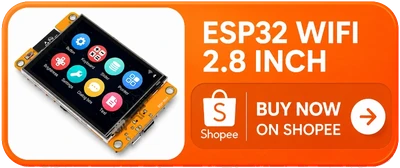

# tamaclaude

### **Tamagotchi + Claude** — a virtual pet whose moods are your coding sessions.

*[อ่านภาษาไทย](README.th.md)*

A desk device that shows what Claude Code is doing right now. A blocky orange mascot
lives on a small screen next to your keyboard: it types when Claude types, waves when a
session needs your answer, and celebrates when a build finishes. The bars at the bottom
are your Claude usage quota.


Nothing is on the network. A menu bar app on your Mac reads Claude Code's hooks and
pushes a small snapshot to the board over Bluetooth LE.

## What the screen says

**While a session runs**

| Busy | Waiting for you | Done |
|:--|:--|:--|
|  |  |  |
| Up to three sessions and the tool each one is using. | A session stopped and wants an answer. | The mascot celebrates a finished turn. |

**When nothing is happening**

| Idle | No sessions | Offline |
|:--|:--|:--|
|  |  |  |
| One session, sleeping. Night sky and clock. | The mascot strolls. Clock and date. | The Mac is out of range or the app is not running. |

**Quota**

| Normal | Running hot | Unknown |
|:--|:--|:--|
|  |  |  |
| The current 5-hour window and the weekly one. | Near the limit; the tick marks your pace against the clock. | `--`, never a guess, when no number has arrived. |

## What you need

**Hardware**

- An **ESP32-2432S028R** board — the "Cheap Yellow Display", 2.8" 320x240, roughly 300 baht.
  Tested against ESP32-D0WD-V3 rev 3.1, 4 MB flash, no PSRAM.
- A **USB data cable** for the board's micro-USB port. Charge-only cables do not enumerate.

<a href="https://s.shopee.co.th/9fJTGEoal1"></a>

**Mac**

- macOS 14 or newer, with Bluetooth.
- [Claude Code](https://claude.com/claude-code) installed and logged in.

The Mac app is always built from source. The firmware you can either download or build —
step 2 has both routes.

## 1. Get the repository and the Swift compiler

```bash
xcode-select --install
git clone https://github.com/thaitop/tamaclaude.git
cd tamaclaude
```

## 2. Put the firmware on the board

Plug the board in and put its serial port into a variable, so the commands below work
as written:

```bash
PORT=$(ls /dev/cu.usbserial-* | head -1)
echo "$PORT"
```

That should print one path, something like `/dev/cu.usbserial-1420` — the number differs
from board to board and from port to port, which is why nothing below spells it out. If
it prints nothing, see [Troubleshooting](#troubleshooting).

`PORT` only exists in the terminal window you typed it in; if you open a new one, set it
again.

### Option A — flash a ready-made image (no ESP-IDF)

Download `tamaclaude-esp32-*.bin` from the
[latest release](https://github.com/thaitop/tamaclaude/releases/latest). It is one file,
about 1 MB, containing the bootloader, the partition table and the app.

```bash
python3 -m pip install esptool
python3 -m esptool --chip esp32 --port "$PORT" \
    write_flash 0x0 ~/Downloads/tamaclaude-esp32-1.0.0.bin
```

That is the whole toolchain: about 10 MB of Python, no compiler. Skip to step 3.

### Option B — build it yourself

Take this route if you want to change the firmware, or if your board turns out to need
different panel settings.

Build tools:

```bash
brew install cmake ninja dfu-util python3
```

ESP-IDF — this is the big one, roughly 2 GB. v5.5 is what this firmware is built and
tested against; the component manifest accepts 5.4 and newer:

```bash
mkdir -p ~/esp && cd ~/esp
git clone -b v5.5 --recursive https://github.com/espressif/esp-idf.git
cd esp-idf && ./install.sh esp32
```

Then, from the repository, load the toolchain into your shell and flash:

```bash
cd firmware
. $HOME/esp/esp-idf/export.sh
idf.py -p "$PORT" flash monitor
```

The `export.sh` line is per-shell and is not permanent; open a new terminal and you run
it again. The first build takes several minutes. If anything here goes wrong, Espressif's
own [getting-started guide](https://docs.espressif.com/projects/esp-idf/en/v5.5/esp32/get-started/)
is the authority.

### Either way

The screen lights up and the board starts announcing itself over Bluetooth as
`tamaclaude-3f7a` — the last part comes from its MAC address, so you can tell two boards
apart. With `idf.py monitor` running you can watch it happen; press `Ctrl+]` to leave.

## 3. Install the Mac app

```bash
cd ../host
./Scripts/make-app.sh --install
```

This builds `tamaclaude.app`, copies it to `/Applications`, and launches it. macOS asks
for Bluetooth permission the first time — say yes, or the app can never see the board.

A small mascot icon appears in your menu bar. Click it for the quota panel; click the
gear for settings.

## 4. Connect it to Claude Code

Everything below is in the gear menu:

- **Install hooks in ~/.claude/settings.json** — this is the one that matters. It teaches
  Claude Code to tell the app what it is doing. Nothing appears on the board without it.
  Your existing settings are kept, and a backup is written beside the file.
- **Board** — pick your board by name, or leave it on *Any board*.
- **Brightness** — the slider drives the screen's backlight.
- **Launch at login** — so it is running before you start work.

Start a Claude Code session in any terminal. Within a second or two the mascot should
start moving.

## 5. Quota on the board

The bars at the bottom of the screen have two independent sources, both optional:

- **Show usage on the board** (gear menu) installs a Claude Code statusline that hands
  the app your current usage. It needs no password, but it only updates while Claude Code
  is running.
- **Set session key…** (gear menu) lets the app ask claude.ai directly, so the number
  keeps moving even with Claude Code closed. **Refresh quota** then chooses how often
  (Off / 60s / 5 min).

> **About the session key.** It is the `sessionKey` cookie of a logged-in claude.ai
> browser session, and it is a **full-account credential** — anyone holding it can act as
> your account. The app stores it in `~/.tamaclaude/session-key` with mode 600 and never
> puts it in a command line, an environment variable, or a log. Take it out at any time
> by deleting that file, and revoke it by logging out of claude.ai in the browser you
> copied it from. If you would rather not, skip this — the statusline route above still
> shows a number.
>
> To get one: in your browser, open claude.ai while logged in → DevTools → Application →
> Cookies → `claude.ai` → copy the value of `sessionKey`.

## Troubleshooting

**No `/dev/cu.usbserial-*` when the board is plugged in.**
Usually the cable — many micro-USB cables carry power only. Failing that, the board's
USB-serial chip (CH340) may need a driver on older macOS releases.

**Flashing stops at "Connecting........".**
Hold the **BOOT** button on the board, start `idf.py flash`, and release it once the log
says `Connecting`. Also close any serial monitor still holding the port.

**The screen is on but the colours are wrong, or the image is mirrored.**
Some batches of this board ship a different panel than the one this firmware was measured
against. Run the probe project in `firmware/probe/` to read out what your panel actually
reports, then change the two constants it disagrees with in `firmware/main/ct_lcd.c`:
the `0x36` (MADCTL) value for orientation and mirroring, and `0x20` (inversion off) versus
`0x21` (inversion on) for inverted colours.

**The board never shows up in the Board menu.**
Check that the app has Bluetooth permission in System Settings → Privacy & Security →
Bluetooth, that the board is powered, and that nothing else is connected to it — the
firmware accepts exactly one connection at a time.

**macOS asks for Bluetooth permission again after every rebuild.**
Expected. The app is signed ad-hoc, so each build is a new identity as far as macOS is
concerned. There is no way around it without an Apple Developer ID.

**The mascot never moves.**
The hooks are probably not installed — gear menu → *Install hooks in
~/.claude/settings.json*. Sessions already open when you install them keep the old
settings; start a new one. *Open log* in the gear menu shows what the app is receiving.

## Known limits

- **macOS only.** The desk-side app is a Swift menu bar app; there is no Linux or Windows
  build.
- **No over-the-air updates.** New firmware means plugging the USB cable back in.
- **The touchscreen and speaker are unused.** The panel is touch-capable and the board has
  a speaker pin; neither is wired up yet.
- **Ad-hoc signing.** The app is not notarised, so it is built per-machine rather than
  handed around.

## License

MIT — see [LICENSE](LICENSE).
