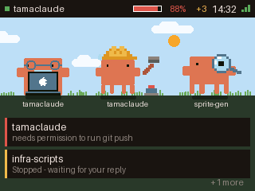
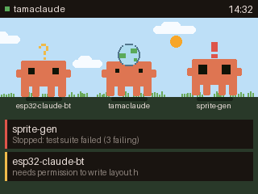
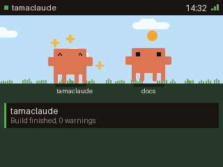
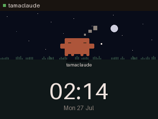
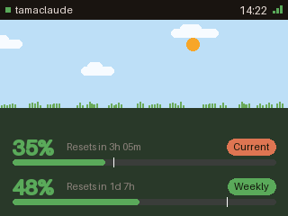
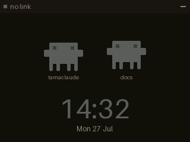
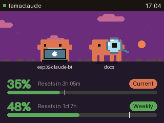
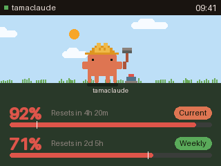
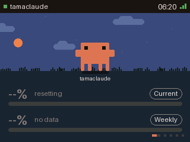
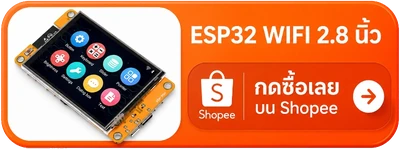

# tamaclaude

### **Tamagotchi + Claude** — สัตว์เลี้ยงเสมือนที่อารมณ์ของมันคือ session เขียนโค้ดของคุณ

*[Read in English](README.md)*

อุปกรณ์ตั้งโต๊ะที่บอกว่า Claude Code กำลังทำอะไรอยู่ตอนนี้ มาสคอตส้มทรงเหลี่ยมอาศัยอยู่บนจอเล็กๆ
ข้างคีย์บอร์ด — พิมพ์ตามตอน Claude พิมพ์ โบกมือตอนมี session รอคำตอบจากคุณ และดีใจตอนบิลด์เสร็จ
แถบด้านล่างคือโควตาการใช้งาน Claude ของคุณ



ไม่มีอะไรวิ่งออกอินเทอร์เน็ต แอปบนแถบเมนูของ Mac อ่าน hook ของ Claude Code แล้วส่งข้อมูลก้อนเล็กๆ
ไปที่บอร์ดผ่าน Bluetooth LE

## จอบอกอะไรบ้าง

**ตอนมี session ทำงานอยู่**

| กำลังยุ่ง | รอคุณอยู่ | เสร็จแล้ว |
|:--|:--|:--|
|  |  |  |
| มากสุดสาม session พร้อมเครื่องมือที่แต่ละตัวใช้อยู่ | session หยุดแล้วรอคำตอบจากคุณ | มาสคอตดีใจกับเทิร์นที่เพิ่งจบ |

**ตอนไม่มีอะไรเกิดขึ้น**

| ว่าง | ไม่มี session | ออฟไลน์ |
|:--|:--|:--|
|  |  |  |
| มี session เดียวและมันหลับอยู่ ฟ้ากลางคืนกับนาฬิกา | มาสคอตเดินเล่น มีนาฬิกาและวันที่ | Mac อยู่ไกลเกินไป หรือแอปไม่ได้เปิดอยู่ |

**โควตา**

| ปกติ | ใกล้เต็ม | ยังไม่รู้ค่า |
|:--|:--|:--|
|  |  |  |
| หน้าต่าง 5 ชั่วโมงปัจจุบันกับรายสัปดาห์ | ใกล้ชนเพดาน ขีดเล็กๆ บอกจังหวะการใช้เทียบกับเวลา | ขึ้น `--` ไม่เดาค่าให้ ตอนที่ยังไม่มีตัวเลขมาถึง |

## ของที่ต้องมี

**ฮาร์ดแวร์**

- บอร์ด **ESP32-2432S028R** หรือที่เรียกกันว่า "Cheap Yellow Display" จอ 2.8" 320x240
  ราคาราวๆ 300 บาท ทดสอบกับ ESP32-D0WD-V3 rev 3.1 แฟลช 4 MB ไม่มี PSRAM
- **สาย USB ที่ส่งข้อมูลได้** สำหรับพอร์ต micro-USB ของบอร์ด สายชาร์จอย่างเดียวจะไม่ขึ้นพอร์ต

<a href="https://s.shopee.co.th/9fJTGEoal1"></a>

**เครื่อง Mac**

- macOS 14 ขึ้นไป และมี Bluetooth
- ติดตั้ง [Claude Code](https://claude.com/claude-code) และล็อกอินแล้ว
- พื้นที่ดิสก์ราว 3 GB สำหรับ toolchain ของ ESP32

ทุกอย่างในนี้บิลด์เองบนเครื่องคุณ ไม่มีไฟล์สำเร็จรูปให้โหลด

## 1. ติดตั้ง toolchain

Xcode Command Line Tools (เอาไว้ให้ได้คอมไพเลอร์ Swift):

```bash
xcode-select --install
```

เครื่องมือสำหรับบิลด์ firmware:

```bash
brew install cmake ninja dfu-util python3
```

ESP-IDF v5.5 — ตัวใหญ่สุด ราว 2 GB:

```bash
mkdir -p ~/esp && cd ~/esp
git clone -b v5.5 --recursive https://github.com/espressif/esp-idf.git
cd esp-idf && ./install.sh esp32
```

ทุกครั้งที่จะบิลด์ firmware ต้องโหลด toolchain เข้าเชลล์นั้นก่อน:

```bash
. $HOME/esp/esp-idf/export.sh
```

บรรทัดนี้มีผลเฉพาะเชลล์ที่รัน ไม่ถาวร เปิดเทอร์มินัลใหม่ก็ต้องรันใหม่
ถ้าติดขั้นตอนไหน เอกสาร
[getting started ของ Espressif](https://docs.espressif.com/projects/esp-idf/en/v5.5/esp32/get-started/)
คือตัวจริง

จากนั้นโคลน repo นี้:

```bash
git clone https://github.com/thaitop/tamaclaude.git
cd tamaclaude
```

## 2. แฟลชบอร์ด

เสียบบอร์ดแล้วหาพอร์ตอนุกรมของมัน:

```bash
ls /dev/cu.usbserial-*
```

ควรเห็นหนึ่งรายการ เช่น `/dev/cu.usbserial-1420` ถ้าไม่เห็นอะไรเลยดูหัวข้อ
[แก้ปัญหา](#แก้ปัญหา)

บิลด์แล้วแฟลช (เปลี่ยนชื่อพอร์ตเป็นของคุณ):

```bash
cd firmware
. $HOME/esp/esp-idf/export.sh
idf.py -p /dev/cu.usbserial-1420 flash monitor
```

ครั้งแรกใช้เวลาหลายนาที พอเสร็จจอจะติดและล็อกจะจบด้วยบรรทัดประมาณนี้:

```
advertising as tamaclaude-3f7a
```

ชื่อนั้นคือตัวตนของบอร์ดบน Bluetooth ส่วนท้ายมาจาก MAC address ของมัน จึงใช้แยกบอร์ดสองตัวออกจากกันได้
กด `Ctrl+]` เพื่อออกจาก monitor

## 3. ติดตั้งแอปบน Mac

```bash
cd ../host
./Scripts/make-app.sh --install
```

คำสั่งนี้บิลด์ `tamaclaude.app` ก๊อปไป `/Applications` แล้วเปิดให้เลย macOS จะขอสิทธิ์ Bluetooth
ครั้งแรก — ต้องอนุญาต ไม่งั้นแอปจะมองไม่เห็นบอร์ดตลอดไป

ไอคอนมาสคอตเล็กๆ จะโผล่บนแถบเมนู คลิกเพื่อดูแผงโควตา คลิกรูปเฟืองเพื่อตั้งค่า

## 4. ต่อเข้ากับ Claude Code

ทั้งหมดนี้อยู่ในเมนูเฟือง:

- **Install hooks in ~/.claude/settings.json** — ตัวที่สำคัญที่สุด มันสอนให้ Claude Code
  บอกแอปว่ากำลังทำอะไรอยู่ ถ้าไม่กดอันนี้จอจะไม่มีอะไรขึ้นเลย ค่าที่คุณตั้งไว้เดิมยังอยู่ครบ
  และมีไฟล์สำรองเขียนไว้ข้างๆ ให้ด้วย
- **Board** — เลือกบอร์ดตามชื่อ หรือปล่อยไว้ที่ *Any board*
- **Brightness** — สไลเดอร์คุมไฟหลังจอ
- **Launch at login** — ให้แอปเปิดรออยู่ก่อนเริ่มงาน

เปิด session ของ Claude Code ในเทอร์มินัลไหนก็ได้ ไม่เกินหนึ่งสองวินาทีมาสคอตจะเริ่มขยับ

## 5. โควตาบนจอ

แถบด้านล่างของจอมีสองท่อที่เป็นอิสระต่อกัน และเป็นทางเลือกทั้งคู่:

- **Show usage on the board** (เมนูเฟือง) ติดตั้ง statusline ของ Claude Code ที่ส่งค่าการใช้งาน
  ปัจจุบันให้แอป ไม่ต้องใช้รหัสผ่านใดๆ แต่ค่าจะขยับเฉพาะตอนที่ Claude Code เปิดอยู่
- **Set session key…** (เมนูเฟือง) ให้แอปถาม claude.ai ตรงๆ ตัวเลขจึงเดินต่อแม้ปิด Claude Code
  ไปแล้ว จากนั้น **Refresh quota** เลือกความถี่ (Off / 60s / 5 min)

> **เรื่อง session key** มันคือคุกกี้ `sessionKey` ของเบราว์เซอร์ที่ล็อกอิน claude.ai อยู่ และเป็น
> **รหัสผ่านระดับทั้งบัญชี** — ใครถือไปก็ทำอะไรในนามบัญชีคุณได้ แอปเก็บมันไว้ที่
> `~/.tamaclaude/session-key` โหมด 600 และไม่เคยใส่มันลงบรรทัดคำสั่ง ตัวแปรสภาพแวดล้อม
> หรือไฟล์ล็อก ถอนออกเมื่อไหร่ก็ได้ด้วยการลบไฟล์นั้น และเพิกถอนตัวคีย์ด้วยการล็อกเอาต์ claude.ai
> จากเบราว์เซอร์ที่คุณก๊อปมา ถ้าไม่สบายใจก็ข้ามไปได้ — ท่อ statusline ด้านบนก็มีตัวเลขให้ดูอยู่แล้ว
>
> วิธีเอามา: เปิด claude.ai ในเบราว์เซอร์ตอนล็อกอินอยู่ → DevTools → Application → Cookies →
> `claude.ai` → ก๊อปค่าของ `sessionKey`

## แก้ปัญหา

**เสียบบอร์ดแล้วไม่มี `/dev/cu.usbserial-*`**
ส่วนใหญ่เป็นที่สาย — สาย micro-USB จำนวนมากต่อแต่ไฟ ไม่ต่อข้อมูล ถ้าไม่ใช่สาย ชิป USB-serial
ของบอร์ด (CH340) อาจต้องลงไดรเวอร์บน macOS รุ่นเก่า

**แฟลชแล้วค้างที่ "Connecting........"**
กดปุ่ม **BOOT** บนบอร์ดค้างไว้ สั่ง `idf.py flash` แล้วปล่อยตอนล็อกขึ้นคำว่า `Connecting`
และปิด serial monitor ที่ยังจับพอร์ตอยู่ด้วย

**จอติดแต่สีเพี้ยน หรือภาพกลับด้าน**
บอร์ดรุ่นนี้บางล็อตมาพร้อมจอคนละตัวกับที่ firmware นี้วัดค่าไว้ ให้รันโปรเจกต์ probe ใน
`firmware/probe/` เพื่ออ่านว่าจอของคุณตอบอะไรจริง แล้วแก้ค่าสองตัวที่ไม่ตรงใน
`firmware/main/ct_lcd.c` — ค่าของคำสั่ง `0x36` (MADCTL) สำหรับทิศทางและการกลับด้าน
และ `0x20` (ปิด inversion) กับ `0x21` (เปิด inversion) สำหรับสีที่กลับกัน

**บอร์ดไม่โผล่ในเมนู Board สักที**
เช็กว่าแอปได้สิทธิ์ Bluetooth ใน System Settings → Privacy & Security → Bluetooth
ว่าบอร์ดมีไฟเข้า และไม่มีอะไรอื่นต่ออยู่กับมัน — firmware รับการเชื่อมต่อได้ทีละหนึ่งเท่านั้น

**macOS ขอสิทธิ์ Bluetooth ใหม่ทุกครั้งที่บิลด์**
เป็นเรื่องปกติ แอปเซ็นแบบ adhoc ทุกการบิลด์จึงเป็นคนละตัวตนในสายตา macOS
ไม่มีทางเลี่ยงถ้าไม่มี Apple Developer ID

**มาสคอตไม่ขยับเลย**
น่าจะยังไม่ได้ติดตั้ง hook — เมนูเฟือง → *Install hooks in ~/.claude/settings.json*
session ที่เปิดค้างอยู่ก่อนหน้าจะยังใช้ค่าเดิม ให้เปิด session ใหม่ ส่วน *Open log* ในเมนูเฟือง
จะบอกว่าแอปได้รับอะไรมาบ้าง

## ข้อจำกัดที่รู้อยู่

- **macOS เท่านั้น** ฝั่งโต๊ะทำงานเป็นแอปแถบเมนูภาษา Swift ยังไม่มีตัวสำหรับ Linux หรือ Windows
- **ไม่มีอัปเดตผ่านอากาศ** firmware ตัวใหม่แปลว่าต้องเสียบสาย USB อีกครั้ง
- **จอสัมผัสกับลำโพงยังไม่ได้ใช้** จอตัวนี้สัมผัสได้และบอร์ดมีขาลำโพง แต่ยังไม่ได้ต่อทั้งคู่
- **เซ็นแบบ adhoc** แอปไม่ได้ notarise จึงเป็นของที่บิลด์ทีละเครื่อง ไม่ใช่ของที่ส่งต่อกันได้

## สัญญาอนุญาต

MIT — ดู [LICENSE](LICENSE)
